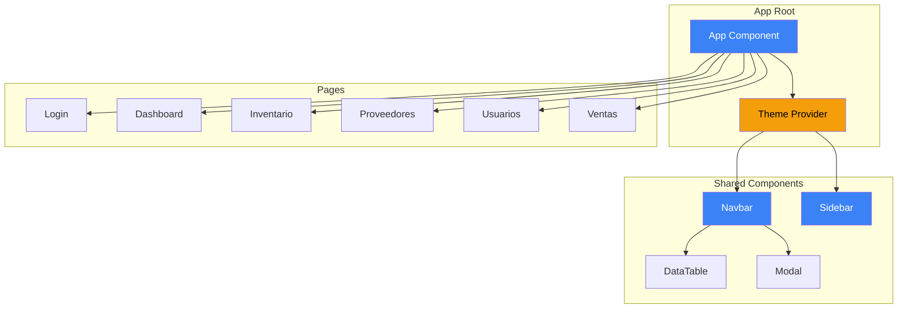

# 🚀 Plan de Migración a Hero UI - DICSAR Frontend

## Resumen Ejecutivo
Migración completa del frontend Angular 19 a Hero UI con tema personalizado azul/amarillo y soporte dark/light mode.

## 🎨 Paleta de Colores Propuesta

### Colores Primarios (Azul)
| Token | Valor | Uso |
|-------|-------|-----|
| `--primary-50` | `#eff6ff` | Fondos muy claros |
| `--primary-100` | `#dbeafe` | Hover states |
| `--primary-200` | `#bfdbfe` | Bordes suaves |
| `--primary-500` | `#3b82f6` | Color principal |
| `--primary-600` | `#2563eb` | Hover principal |
| `--primary-700` | `#1d4ed8` | Active states |
| `--primary-900` | `#1e3a8a` | Texto oscuro |

### Colores Secundarios (Amarillo/Dorado)
| Token | Valor | Uso |
|-------|-------|-----|
| `--secondary-50` | `#fffbeb` | Fondos amarillos |
| `--secondary-100` | `#fef3c7` | Hover states |
| `--secondary-400` | `#fbbf24` | Acentos |
| `--secondary-500` | `#f59e0b` | Color secundario |
| `--secondary-600` | `#d97706` | Hover secundario |

## 📋 Arquitectura del Tema

### Estructura de Archivos
```
src/
├── styles/
│   ├── globals.css          # Estilos globales base
│   ├── theme.css            # Variables CSS del tema
│   └── tailwind.config.js   # Configuración Tailwind
├── app/
│   ├── providers/
│   │   └── theme.provider.ts    # Provider para manejo de tema
│   └── components/
│       └── theme-toggle/        # Componente toggle dark/light
```

### Componentes a Migrar

#### 1. Shared Components (Prioridad Alta)
- [ ] `navbar.component` - Navegación principal
- [ ] `sidebar.component` - Menú lateral
- [ ] `data-table.component` - Tablas de datos
- [ ] `modal.component` - Modales

#### 2. Pages (Prioridad Media-Alta)
- [ ] `login.component` - Página de login
- [ ] `dashboard.component` - Dashboard principal
- [ ] `inventario.component` - Gestión de inventario
- [ ] `proveedores.component` - Gestión de proveedores
- [ ] `usuarios.component` - Gestión de usuarios
- [ ] `ventas.component` - Módulo de ventas
- [ ] `historial-precios.component` - Historial
- [ ] `clientes.component` - Clientes

#### 3. Seguridad (Prioridad Media)
- [ ] `cambiarcontrasena.component`
- [ ] `miperfil.component`

## 🔧 Configuración Técnica

### Dependencias a Instalar
```bash
# Hero UI + NextUI
npm install @heroui/react @nextui-org/react

# Tailwind CSS (requerido por Hero UI)
npm install -D tailwindcss postcss autoprefixer
npx tailwindcss init

# Iconos (Heroicons)
npm install @heroicons/react

# Utilidades
npm install clsx tailwind-merge
```

### Configuración Tailwind
```javascript
// tailwind.config.js
module.exports = {
  darkMode: 'class',
  content: [
    "./src/**/*.{html,ts}",
    "./node_modules/@heroui/react/**/*.{js,ts,jsx,tsx}",
  ],
  theme: {
    extend: {
      colors: {
        primary: {
          50: '#eff6ff',
          100: '#dbeafe',
          500: '#3b82f6',
          600: '#2563eb',
          700: '#1d4ed8',
        },
        secondary: {
          50: '#fffbeb',
          100: '#fef3c7',
          500: '#f59e0b',
          600: '#d97706',
        },
      },
    },
  },
  plugins: [],
}
```

## 🌓 Estrategia Dark/Light Mode

### Implementación
1. **CSS Variables**: Definir variables para ambos modos
2. **Clase `.dark`**: Aplicada al elemento `<html>`
3. **LocalStorage**: Persistencia de preferencia
4. **System Preference**: Detectar preferencia del sistema

### Tokens de Color por Modo

#### Light Mode (default)
```css
:root {
  --bg-primary: #ffffff;
  --bg-secondary: #f8fafc;
  --text-primary: #0f172a;
  --text-secondary: #475569;
  --border-color: #e2e8f0;
}
```

#### Dark Mode
```css
.dark {
  --bg-primary: #0f172a;
  --bg-secondary: #1e293b;
  --text-primary: #f8fafc;
  --text-secondary: #94a3b8;
  --border-color: #334155;
}
```

## 📦 Mapeo de Componentes PrimeNG → Hero UI

| PrimeNG Component | Hero UI Equivalent |
|-------------------|-------------------|
| p-table | Table |
| p-button | Button |
| p-input | Input |
| p-dropdown | Select |
| p-dialog | Modal |
| p-card | Card |
| p-toast | Toast notifications |
| p-sidebar | Sidebar |
| p-menu | Menu / Dropdown |
| p-calendar | Calendar |
| p-inputnumber | Number Input |

## 🔄 Flujo de Migración

### Fase 1: Setup (1 sprint)
1. Instalar dependencias Hero UI
2. Configurar Tailwind CSS
3. Crear sistema de temas
4. Implementar Theme Provider
5. Crear componente Theme Toggle

### Fase 2: Shared Components (1 sprint)
1. Migrar Navbar
2. Migrar Sidebar
3. Migrar DataTable
4. Migrar Modal

### Fase 3: Core Pages (2 sprints)
1. Login
2. Dashboard
3. Inventario
4. Proveedores

### Fase 4: Remaining Pages (1 sprint)
1. Usuarios
2. Ventas
3. Historial Precios
4. Clientes
5. Seguridad

### Fase 5: Polish (1 sprint)
1. Responsive design
2. Animaciones
3. Testing
4. Documentación

## 🎯 Criterios de Aceptación

- [ ] Todos los componentes usan Hero UI
- [ ] Tema azul/amarillo aplicado consistentemente
- [ ] Toggle dark/light funciona en todas las páginas
- [ ] Preferencia de tema persiste en localStorage
- [ ] Diseño responsive en mobile/tablet/desktop
- [ ] Sin regresiones funcionales
- [ ] Performance igual o mejor

## 📊 Diagrama de Arquitectura



## 📝 Notas Técnicas

### Convenciones de Nombre
- Componentes: `kebab-case` (ej: `theme-toggle`)
- Clases CSS: `lowercase-with-dashes`
- Variables: `--prefix-name`

### Performance Consideraciones
- Usar `OnPush` change detection donde sea posible
- Lazy loading de módulos de páginas
- Optimizar imágenes

### Accesibilidad
- ARIA labels en todos los componentes interactivos
- Contraste de colores WCAG 2.1 AA
- Keyboard navigation
